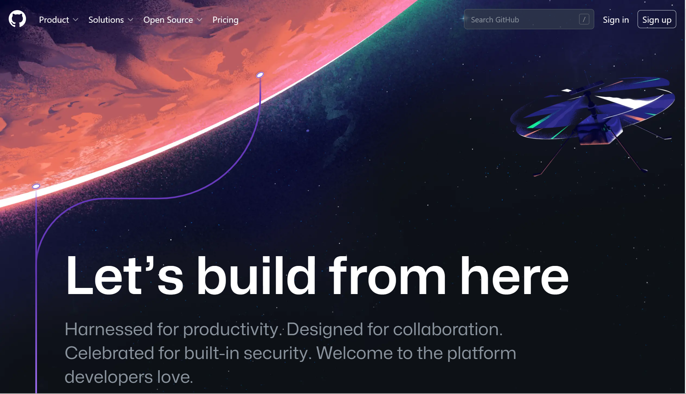
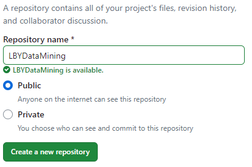
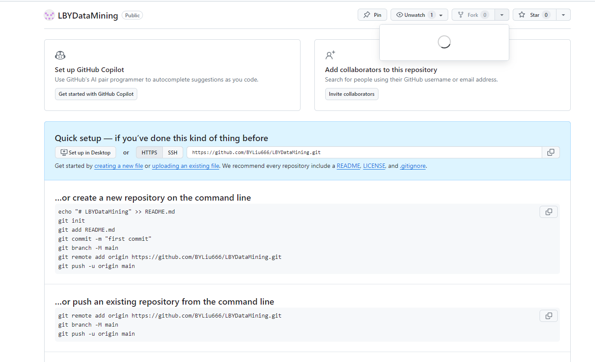

# 数据挖掘课程作业

##一  注册GitHub用户
 
1.**进入github的官网**
在 Web 浏览器中输入https://github.com/，进入 GitHub 的官方网站。
2. **点击右上角注册按钮sign up，来到注册页面**

3. **验证电子邮件地址**
   注册完成后，GitHub 会向您提供的电子邮件地址发送一封验证邮件。请登录您的电子邮箱，查找来自 GitHub 的邮件，并点击邮件中的验证链接完成验证。
4. **验证电子邮件地址**：注册后，GitHub 会向提供的电子邮件地址发送一封确认邮件。查看电子邮件收件箱，并按照邮件中的指示完成验证过程。

5. **设置个人资料**：一旦注册成功，我们可以上传头像、填写个人资料和设定个人主页。点击头像旁边的设置按钮，我们可以设置个人信息、邮箱、通知偏好和安全选项。

## 二、建立一个库LBYDataMining

1. **登录GitHub**：已有GitHub账号，输入邮箱和密码登录。

2. **导航到仓库页面**：点击 “New” 按钮创建新仓库,在页面右上角找到 “New” 按钮，点击它进入创建新仓库页面。
3. **填写仓库信息**：
   - **Repository name**（仓库名称）：输入 "LBYDataMining"。
   - **Description**（描述）（可选）：输入一个简短的描述。
   - **Public / Private**（公开/私有）：选择适合需求的选项。如果想要所有人都能够查看仓库，则选择 "Public"（公开）。
   - **Initialize this repository with**（初始化仓库）：如果想在仓库中添加一个 README 文件，选择 "Add a README file"（添加一个 README 文件）。
   - **Add .gitignore**（添加 .gitignore 文件）：根据项目需求选择合适的选项。
   - **Choose a license**（选择许可证）：根据项目需求选择合适的选项。
   
4. **点击 “Create repository”,填写完仓库信息后，点击绿色按钮 “Create repository” 创建开源仓库。

## 三、上传PPT到LBYDataMining

1. **登录GitHub**：确保已经登录到 GitHub 帐户。

2. **导航到 "LBYDataMining" 仓库页面**：在 GitHub 主页或仓库列表中找到并点击 "LBYDataMining" 仓库，进入该仓库的页面。

3. **点击 "Add file" 按钮**：在仓库页面的右上角，点击 "Add file"，然后选择 "Upload files"。

4. **上传PPT文件**：
   - **拖拽上传**：可以直接将 PPT 文件拖拽到上传区域。
   - **点击上传**：或者点击上传区域选择文件，然后选择要上传的 PPT 文件。
![]  (4.png)
5. **填写提交信息**：在页面下方的 "Commit changes" 区域，输入提交信息，描述上传的 PPT 文件。

6. **提交**：完成上述步骤后，点击 "Commit changes" 提交更改。
## 四、想学习或获得的计算机技能
1. **深度学习中多模态的学习**
   多模态是深度学习的一个重要研究方向，具体来说，是在多种不同的信息源（不同的信息形式）中获取信息表达。将多种形式的数据，如表格和图片的形式输入到神经网络中，进行特征提取等操作，以完成目的。
对于多模态有很多挑战：
 - **表示的方法**：联合表示将多个模态的信息一起映射到一个统一的多模态向量空间,协同表示负责将多模态中的每个模态分别映射到各自的表示空间，但映射后的向量之间满足一定的相关性约束。
 - **翻译/转化/映射**：信号的映射，比如给一个图像，将图像翻译成文字，文字翻译成图像，信息转化成统一形式后来应用方式，这里就跟专门研究翻译的领域是重叠，基于实例的翻译，涉及到检索，字典（规则）等，基于生成方法如生成翻译的内容.
 - **对齐**：多模态对齐定义为从两个或多个模态中查找实例子组件之间的关系和对应，研究不同的信号如何对齐（比如给电影，找出剧本中哪一段）。
 - **融合**：比如情感分析中语气和语句的融合等，这个最难也是被研究最多的领域，比如音节和唇语头像怎么融合。
 - 具体来说，我想获取的技能为能通过代码的方式，解决多模态的智慧医疗问题。
3. **可解释性**
   在计算机视觉（CV）领域中，可解释性指的是对模型如何做出特定预测或决策的内部工作机制的理解。这个概念越来越受到重视，尤其是在深度学习模型因其“黑箱”性质而广泛应用于多种任务时。可解释性对于增强模型的透明度、验证模型决策的合理性以及提高用户对AI系统的信任非常关键。下面详细介绍一下计算机视觉中的可解释性的目的、挑战以及一些实现方法。
-**目的**：
   (1).增强信任：
使用户信任模型的判断，特别是在涉及关键决策的领域，如医疗诊断、自动驾驶等。
(2).调试和改进模型：
通过理解模型的行为，开发者可以更有效地诊断错误和弱点，从而改进模型的表现。
(3).法律和道德合规性：
在许多法域和行业，尤其是那些受到严格监管的领域（如欧盟的GDPR），要求AI系统能够解释其决策过程。
-**挑战**
   (1).复杂性与透明度之间的权衡：
深度学习模型，特别是那些用于复杂视觉任务的模型，通常具有高度复杂的结构，这使得直接解释其内部工作机制变得困难。简化模型以提高可解释性往往会牺牲性能。
(2).缺乏标准化：
目前还没有统一的标准或框架来评估不同AI模型的可解释性。这使得比较不同模型的解释性变得复杂。
(3).可解释性与准确性的冲突：
在某些情况下，更简单、更透明的模型可能无法达到与高度复杂模型同样的准确性或效能。
(4).解释的主观性：
不同的解释方法可能导致不同的解释结果，而且同一解释对不同的观察者可能有不同的意义
